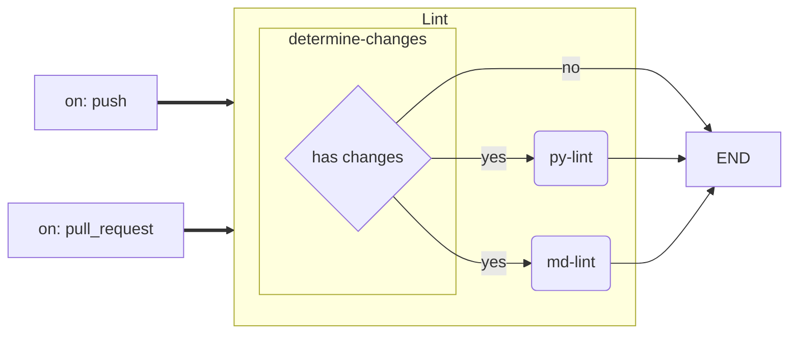
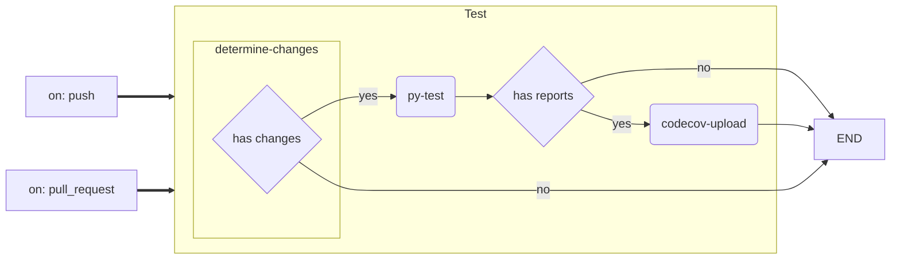
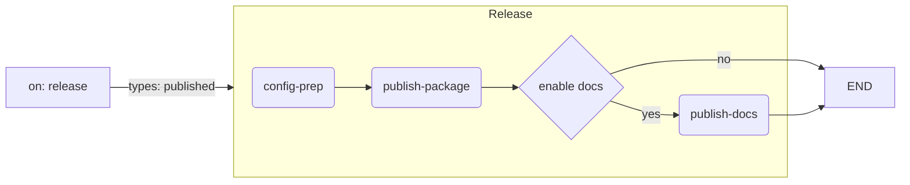

# Workflows

## Lint

```mermaid
flowchart LR
  push[on: push]
  pr[on: pull_request]

  subgraph Lint
    subgraph determine-changes
      cond1{has changes}
    end

    py-lint(py-lint)
    md-lint(md-lint)

    cond1 --> |yes| py-lint
    cond1 --> |yes| md-lint
  end

  End[END]

  push ==> Lint
  pr ==> Lint

  cond1 --> |no| End
  py-lint --> End
  md-lint --> End
```

### py-lint

### md-lint

## Test

```mermaid
flowchart LR
  push[on: push]
  pr[on: pull_request]

  subgraph Test
    subgraph determine-changes
      cond1{has changes}
    end

    py-test(py-test)
    cond2{has reports}
    codecov-upload(codecov-upload)

    cond1 --> |yes| py-test
    py-test --> cond2
    cond2 --> |yes| codecov-upload
  end

  End[END]

  push ==> Test
  pr ==> Test

  cond2 --> |no| End
  codecov-upload --> End

  cond1 --> |no| End
```

### py-test

## Release

```mermaid
flowchart LR
  release[on: release]

  subgraph Release
    config-prep(config-prep)
    publish-package(publish-package)
    cond{enable docs}
    publish-docs(publish-docs)

    config-prep --> publish-package
    publish-package --> cond
    cond --> |yes| publish-docs
  end

  End[END]

  release --> |types: published| Release
  cond --> |no| End
  publish-docs --> End
```

### testpypi

### docs

## Maint

### Delete caches

### Delete workflow runs

### Report rate limits
