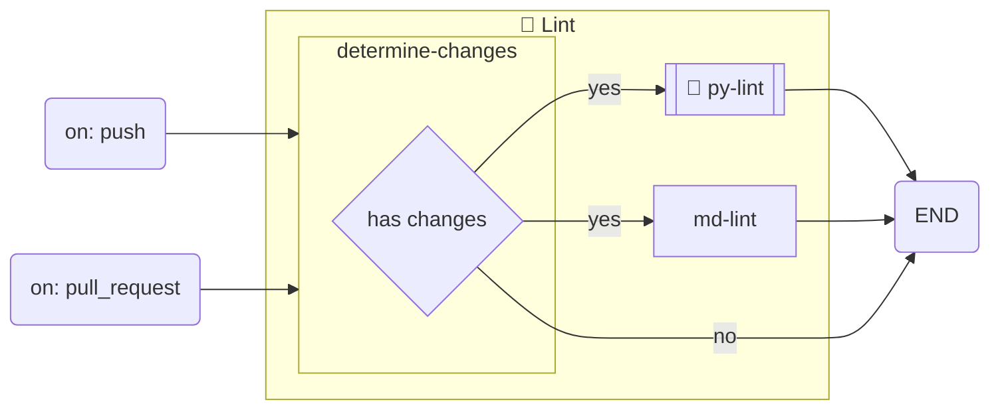
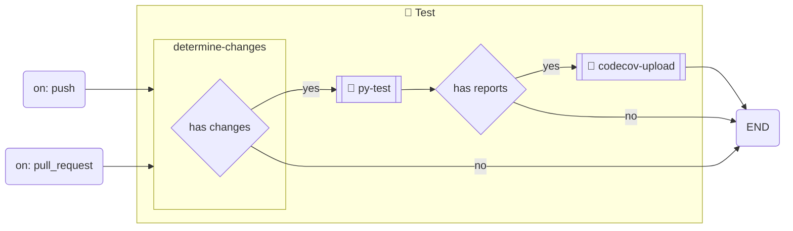
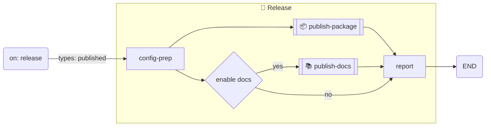

# Workflows

## Lint

```mermaid
flowchart LR
  push(on: push)
  pr(on: pull_request)

  subgraph "🔬 Lint"
    subgraph determine-changes
      cond1{has changes}
    end

    py-lint[["🔬 py-lint"]]
    md-lint[md-lint]

    cond1 --> |yes| py-lint & md-lint
  end

  End(END)

  push & pr --> determine-changes

  py-lint & md-lint --> End
  cond1 --> |no| End
```

### py-lint

## Test

```mermaid
flowchart LR
  push(on: push)
  pr(on: pull_request)

  subgraph "🧪 Test"
    subgraph determine-changes
      cond1{has changes}
    end

    py-test[["🧪 py-test"]]
    cond2{has reports}
    codecov-upload[["📄 codecov-upload"]]

    cond1 --> |yes| py-test
    py-test --> cond2
    cond2 --> |yes| codecov-upload
  end

  End(END)

  push & pr --> determine-changes

  codecov-upload --> End
  cond1 & cond2 --> |no| End
```

### py-test

## Release

```mermaid
flowchart LR
  release(on: release)

  subgraph "🎁 Release"
    config-prep[config-prep]
    publish-package[["📦 publish-package"]]
    cond{enable docs}
    publish-docs[["📚 publish-docs"]]
    report[report]

    config-prep --> publish-package & cond
    cond --> |yes| publish-docs
  end

  End(END)

  release --> |types: published| config-prep
  publish-package & publish-docs --> report
  cond --> |no| report
  report --> End
```

### pypi-upload

### docs

## Maint

### Delete caches

### Delete workflow runs

### Report rate limits
